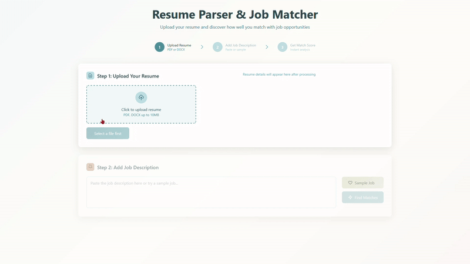

# Resume Parser & Job Matcher


A modern web application that analyzes resumes and matches them against job descriptions, providing detailed compatibility scores and actionable recommendations for job seekers.

## 🚀 Live Demo

**Try it now:** [https://jd-resume-parser.vercel.app/](https://jd-resume-parser.vercel.app/)

Upload your resume and see how well you match with different job opportunities!



## ✨ Features

- **Resume Parsing**: Extract structured data from PDF and DOCX resumes
- **Skill Detection**: Identify technical skills across programming languages, frameworks, and tools
- **Job Matching**: Calculate compatibility scores between resumes and job descriptions
- **Smart Recommendations**: Get personalized advice to improve job match scores
- **Modern UI**: Clean, responsive web interface with mobile support
- **Sample Jobs**: Pre-loaded job descriptions for testing and demonstration


## Quick Start

### Prerequisites

- Python 3.8 or higher
- pip (Python package installer)

### Installation

1. **Clone the repository**
   ```bash
   git clone <your-repo-url>
   cd resume-parser
   ```

2. **Create and activate virtual environment**
   ```bash
   python -m venv venv
   
   # On Windows:
   venv\Scripts\activate
   
   # On macOS/Linux:
   source venv/bin/activate
   ```

3. **Install dependencies**
   ```bash
   pip install -r requirements.txt
   ```

4. **Run the application**
   ```bash
   python main.py
   ```

5. **Open your browser**
   - Navigate to: `http://127.0.0.1:8000`
   - API documentation: `http://127.0.0.1:8000/docs`

## Usage

### Web Interface


1. **Upload Resume**: Drag and drop or click to upload your PDF/DOCX resume
2. **Add Job Description**: Paste a job posting or use one of the sample jobs
3. **Get Results**: View your match score, skill analysis, and recommendations


### API Endpoints

- `GET /` - Web interface
- `POST /upload-resume` - Process resume file
- `POST /match-jobs` - Calculate job compatibility
- `GET /sample-jobs` - Retrieve sample job descriptions
- `GET /health` - API health check

### Sample API Usage

```python
import requests

# Upload resume
with open('resume.pdf', 'rb') as f:
    response = requests.post(
        'http://127.0.0.1:8000/upload-resume',
        files={'resume': f}
    )
    resume_data = response.json()['data']

# Match with job
job_description = "We are looking for a Python developer..."
match_response = requests.post(
    'http://127.0.0.1:8000/match-jobs',
    json={
        'resume_data': resume_data,
        'job_description': job_description
    }
)
match_results = match_response.json()['match']
```

## What Gets Analyzed

### From Resumes
- **Personal Information**: Name, email, phone number
- **Technical Skills**: Programming languages, frameworks, databases, tools
- **Experience**: Work history and positions
- **Education**: Degrees and academic background
- **Achievements**: Notable accomplishments and awards
- **Certifications**: Professional certifications

### Matching Criteria
- **Skills Compatibility** (50% weight): Matches technical skills
- **Experience Level** (30% weight): Evaluates relevant experience
- **Education Requirements** (20% weight): Checks educational background

## File Support

- **PDF**: Full text extraction with layout preservation
- **DOCX**: Microsoft Word document parsing
- **DOC**: Legacy Word document support

## 📁 Project Structure

```
resume-parser/
├── main.py              # FastAPI application
├── resume_parser.py     # Resume parsing logic
├── job_matcher.py       # Job matching algorithms
├── templates/
│   └── index.html       # Web interface
├── sample_data/         # Sample resume files
├── static/              # Static assets (favicon, etc.)
├── images/              # README images
├── requirements.txt     # Python dependencies
└── README.md           # This file
```


## Dependencies

- **FastAPI**: Modern web framework
- **pdfplumber**: PDF text extraction
- **python-docx**: Word document parsing
- **uvicorn**: ASGI server
- **python-multipart**: File upload support

## Development

### Running with Auto-reload
```bash
uvicorn main:app --reload --host 127.0.0.1 --port 8000
```

### Adding New Skills
Edit the `all_skills` list in `resume_parser.py`:
```python
self.all_skills = [
    'your-new-skill',
    # ... existing skills
]
```

### Customizing Match Weights
Modify weights in `job_matcher.py`:
```python
self.weights = {
    'skills': 0.50,      # 50% weight
    'experience': 0.30,  # 30% weight
    'education': 0.20    # 20% weight
}
```

## Contributing

1. Fork the repository
2. Create a feature branch
3. Make your changes
4. Add tests if applicable
5. Submit a pull request

## License

This project is open source and available under the MIT License.

## Support

For questions, issues, or feature requests, please open an issue on GitHub.

---

**Built with ❤️ for job seekers everywhere**
